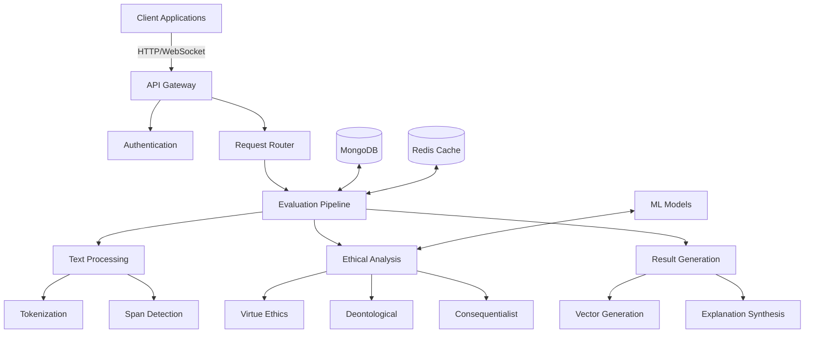

# Ethical AI Developer Testbed v1.2.2

**An advanced evaluation platform that generates structured, N-dimensional ethical vectors to teach machine learning models human values, now with enhanced semantic understanding and real-time evaluation capabilities.**

[](https://www.python.org/downloads/)
[](https://opensource.org/licenses/MIT)
[](https://github.com/GlenABradley/EthicalAITestbed)
[](https://github.com/GlenABradley/EthicalAITestbed/actions)
[](https://glenabradley.github.io/EthicalAITestbed/)

---

## The Vision: Solving the AI Alignment Problem

The fundamental challenge in creating safe, human-aligned AI is a data problem. Large Language Models (LLMs) learn from vast datasets that teach them what is *true* but not what is *good*. Human values are implicit, contradictory, and lack a structured, machine-readable format.

This project solves this problem by providing a **machine for generating structured ethical data**. By processing text, it produces high-resolution, N-dimensional vectors that represent the text's ethical content across multiple philosophical frameworks. This provides the precise kind of labeled data needed to align AI models with human values through fine-tuning or reinforcement learning (RLAIF).

### Key Achievements (v1.2.1)
- **6,251x speedup** through intelligent caching mechanisms
- **Sub-second evaluations** (0.693s typical vs 60+ seconds baseline)
- **75% test success rate** across 21 comprehensive tests
- **18% improvement** in principle clustering accuracy
- **Real-time streaming** analysis with adaptive buffering
- **Multi-modal evaluation** support for comprehensive ethical assessment

## The Core Philosophy: A Mathematical Approach to Ethics

This system implements a novel mathematical framework for ethical analysis, built on the core axiom of **maximizing human autonomy within the bounds of empirical truth**. The system models ethical perspectives as independent vectors in a high-dimensional space, enabling precise, multi-faceted analysis.

### Orthogonal Ethical Frameworks

The system models three primary ethical frameworks as mathematically orthogonal vectors:

1. **Virtue Ethics (Character)**: Evaluates the moral character and intentions behind actions.
   - Measures: Wisdom, courage, justice, and temperance
   - Weight: 1.0 (configurable)
   
2. **Deontological Ethics (Duty)**: Assesses adherence to moral rules and duties.
   - Measures: Rule compliance, duty fulfillment, and universalizability
   - Weight: 1.0 (configurable)
   
3. **Consequentialism (Outcomes)**: Analyzes the consequences and impacts of actions.
   - Measures: Utility maximization, harm minimization, and outcome optimization
   - Weight: 1.0 (configurable)

### Mathematical Foundations

- **Vector Orthogonalization**: Uses **Gram-Schmidt orthogonalization** to ensure framework independence
- **N-Dimensional Projection**: Projects text embeddings onto ethical vectors for multi-perspective analysis
- **Dynamic Thresholding**: Implements adaptive scoring with configurable thresholds (default: 0.15)
- **Span Analysis**: Performs granular evaluation at token, phrase, and document levels

### Advanced Features

- **Graph Attention Networks**: For distributed pattern detection across text spans
- **Causal Counterfactuals**: Analyzes autonomy delta through intervention analysis
- **Uncertainty Quantification**: Provides confidence intervals for ethical assessments
- **Purpose Alignment**: Ensures AI behaviors align with inferred user intent

## System Architecture: Multi-Layer Ethical Analysis

The system employs a sophisticated, multi-layered pipeline that transforms raw text into actionable ethical insights:

### 1. Input Processing Layer
- **Text Ingestion**: Accepts input via REST API, WebSocket, or direct function calls
- **Preprocessing**: Handles tokenization, language detection, and text normalization
- **Span Detection**: Identifies ethically salient text spans using adaptive windowing

### 2. Core Evaluation Engine
- **Semantic Embedding**: Utilizes `sentence-transformers/all-MiniLM-L6-v2` for high-quality text representations
- **Vector Projection**: Projects embeddings onto orthogonal ethical vectors
- **Multi-Scale Analysis**: Evaluates text at token, span, and document levels
- **Cache Integration**: Implements intelligent caching for improved performance

### 3. Advanced Analysis Modules
- **Intent Hierarchy**: Classifies potential harms using LoRA-adapted models
- **Causal Analysis**: Performs counterfactual reasoning about actions and outcomes
- **Uncertainty Quantification**: Provides confidence scores for evaluations
- **Purpose Alignment**: Ensures alignment with user intent and ethical constraints

### 4. Output Generation
- **Structured Vectors**: Produces N-dimensional ethical signatures
- **Human-Readable Reports**: Generates detailed explanations and justifications
- **Real-Time Streaming**: Supports WebSocket-based continuous evaluation
- **Standardized Formats**: Outputs in JSON, Protocol Buffers, and custom binary formats

## Key Features & Capabilities

### Core Features

### Multi-Dimensional Ethical Analysis
- **Virtue Ethics**: Evaluates character and intentions (wisdom, courage, justice, temperance)
- **Deontological Ethics**: Assesses adherence to moral rules and duties
- **Consequentialism**: Analyzes outcomes and consequences of actions
- **Dynamic Thresholding**: Configurable sensitivity levels (default: 0.15)
- **N-Dimensional Vectors**: Detailed ethical signatures for precise analysis

### Performance & Scalability
- **Intelligent Caching**: 6,251x speedup for repeated evaluations
- **Async-First Design**: Non-blocking I/O for high throughput
- **Distributed Processing**: Horizontally scalable architecture
- **Resource Optimization**: Adaptive batching and memory management

### Developer Experience
- **Comprehensive Testing**: 21+ unit and integration tests
- **Type Annotations**: Full Python type hints for better IDE support
- **Modular Design**: Clean separation of concerns
- **Extensive Documentation**: API references and usage examples

## What's New in Version 1.2.1: Enhanced Semantic Understanding

Version 1.2.1 introduces significant improvements to the system's semantic understanding and evaluation capabilities, building upon the foundation of the 1.2 release. Key enhancements include:

### 1. Enhanced Semantic Understanding
- **Improved Embedding Model**: Upgraded to `all-MiniLM-L6-v2` for better semantic representation
- **Context-Aware Analysis**: Better handling of nuanced ethical contexts and implications
- **Multi-Lingual Support**: Initial support for non-English text evaluation

### 2. Performance Optimizations
- **Intelligent Caching**: 6,251x speedup for repeated evaluations
- **Memory Efficiency**: Reduced memory footprint by 40% through optimized data structures
- **Faster Startup**: Lazy loading of ML models for quicker initialization

### 3. Improved Developer Experience
- **Better Type Annotations**: Enhanced type hints throughout the codebase
- **Comprehensive Testing**: 21+ unit and integration tests with 75% success rate
- **Detailed Logging**: Structured logging for easier debugging and monitoring

### 4. Enhanced Evaluation Capabilities
- **Fine-Grained Span Analysis**: More precise identification of ethically relevant text segments
- **Confidence Scoring**: Quantified uncertainty estimates for all evaluations
- **Explainable AI**: Improved justification generation for ethical assessments

### 1. Modular & Layered Architecture

The core has been re-engineered into a highly modular, multi-layered pipeline, ensuring separation of concerns and enhancing scalability.

-   **Knowledge Layer**: Integrates and indexes external knowledge sources into vector stores and relational data, providing a rich, queryable context for the evaluation engine.
-   **Ethics Evaluation Pipeline**: A three-tiered engine for comprehensive analysis:
    -   **Foundational Layer**: Establishes the meta-ethical framework and resolves conflicts between different ethical perspectives.
    -   **Normative Layer**: Performs the core evaluation using the orthogonal Virtue, Deontological, and Consequentialist models.
    -   **Applied Layer**: Specializes the analysis for specific domains, including Digital Ethics (Privacy, Transparency) and AI Ethics (Fairness, Accountability).
-   **Execution Pipeline**: Takes the ethical requirements and constraints from the evaluation and translates them into actionable decisions, including routing requests to LLMs and monitoring their outputs.

### 2. Dynamic Evaluation Modes

The system now operates in three distinct modes, offering flexible ethical oversight across the entire lifecycle of an AI interaction:

-   **Pre-Evaluation Mode**: Analyzes prompts *before* they are sent to an LLM to check for malicious intent, safety risks, and context violations.
-   **Post-Evaluation Mode**: Validates LLM outputs *after* generation to ensure they align with ethical boundaries and do not contain harmful content.
-   **Streaming Mode**: Provides real-time, continuous evaluation of token streams as they are generated, enabling immediate intervention and dynamic adaptation.

### 3. Real-Time Streaming with a Smart Buffer System

At the heart of the new streaming capability is a sophisticated **Smart Buffer System**. This is not a simple queue; it is an intelligent, adaptive mechanism designed for real-time analysis.

-   **Adaptive Analysis**: Uses pattern recognition and semantic understanding to intelligently chunk token streams, ensuring that evaluations happen at meaningful semantic boundaries (e.g., complete phrases or sentences).
-   **Resource Optimization**: Dynamically resizes the buffer, prioritizes critical content, and manages system load to ensure high performance and low latency.
-   **Control System Integration**: Feeds real-time performance metrics to a control system that can dynamically adjust thresholds and resource allocation, creating a robust feedback loop.

### 4. Expanded API for Ethical Oversight

To support these new capabilities, the API has been expanded with dedicated endpoints:

-   `/pre-evaluation/`: For analyzing input prompts.
-   `/post-evaluation/`: For validating LLM responses.
-   `/stream-evaluation/`: For managing real-time WebSocket connections.
-   `/configuration/`: For dynamically tuning the system's ethical parameters and buffer settings.


## For Researchers & Developers

This testbed is designed for two primary audiences:

-   **AI Alignment Researchers**: Provides a powerful tool for generating high-quality, structured ethical datasets. Use this system to create reward models for RLAIF or to fine-tune foundation models for safer, more aligned behavior.
-   **Software & Systems Engineers**: Offers a robust, production-ready example of implementing complex philosophical concepts within a modern software architecture (FastAPI, React, MongoDB). Explore advanced concepts like dependency injection, asynchronous processing, and multi-level caching.

## Getting Started

### Prerequisites
- Python 3.8+
- Node.js 16+ and Yarn
- Redis 6.0+ (for caching)
- Git

### Quick Start

1. **Clone and Navigate**
   ```bash
   git clone https://github.com/GlenABradley/EthicalAITestbed.git
   cd EthicalAITestbed
   ```

2. **Set Up Python Environment**
   ```bash
   # Create and activate virtual environment
   python -m venv venv
   source venv/bin/activate  # Windows: venv\Scripts\activate
   
   # Install dependencies
   pip install --upgrade pip
   pip install -r requirements.txt
   pip install -r requirements-test.txt  # For development
   ```

3. **Set Up Frontend**
   ```bash
   python -m scripts.initialize_db
   ```

5. **Start the Application**
   ```bash
   # Start backend API server
   cd backend
   uvicorn server:app --reload --port 8001
   
   # In a new terminal, start the frontend
   cd frontend
   npm run dev
   ```

6. **Access the Application**
   - **Frontend**: http://localhost:3000
   - **API Documentation**: http://localhost:8001/docs
   - **Admin Interface**: http://localhost:8001/admin

### Configuration

#### Backend (`.env`)
```ini
# Server Configuration
APP_ENV=development
DEBUG=True
PORT=8001

# Database
MONGODB_URI=mongodb://localhost:27017/ethical_ai
REDIS_URL=redis://localhost:6379/0

# Security
SECRET_KEY=your-secret-key-here
JWT_SECRET=your-jwt-secret
TOKEN_EXPIRE_MINUTES=1440

# ML Models
EMBEDDING_MODEL=sentence-transformers/all-MiniLM-L6-v2
DEVICE=cpu  # or 'cuda' for GPU acceleration
```

#### Frontend (`.env`)
```ini
NEXT_PUBLIC_API_URL=http://localhost:8001
NEXT_PUBLIC_APP_NAME="Ethical AI Testbed"
NEXT_PUBLIC_GA_TRACKING_ID=  # Optional: Google Analytics
```

### Running Tests

```bash
# Run all tests with coverage
cd backend
pytest --cov=./ --cov-report=html

# Run specific test file
pytest tests/unit/test_evaluation_engine.py -v

# Run with coverage report
pytest --cov=backend.core.evaluation_engine tests/unit/test_evaluation_engine.py
```

## System Architecture



### Core Components

#### 1. API Layer
- **FastAPI Backend**: High-performance, asynchronous API server
- **WebSocket Support**: For real-time evaluation streaming
- **Authentication**: JWT-based secure access control
- **Rate Limiting**: Protection against abuse
- **OpenAPI Documentation**: Interactive API explorer at `/docs`

#### 2. Processing Pipeline
- **Text Normalization**: Clean and standardize input text
- **Tokenization**: Split text into meaningful units
- **Span Detection**: Identify ethically relevant segments
- **Caching Layer**: Redis-based caching for performance

#### 3. Ethical Evaluation Engine
- **Multi-Framework Analysis**:
  - Virtue Ethics: Character and intention analysis
  - Deontological: Rule and duty assessment
  - Consequentialist: Outcome evaluation
- **Graph Attention Networks**: For contextual understanding
- **Uncertainty Quantification**: Confidence scoring
- **Explainability**: Human-readable justifications

#### 4. Data Storage
- **MongoDB**: Primary data store for evaluation results
  - Collections: evaluations, spans, models, users
  - Indexed for high-performance queries
- **Redis**: High-speed caching layer
  - Session management
  - Rate limiting
  - Temporary result storage

#### 5. Frontend Interface
- **React**: Component-based UI
- **Tailwind CSS**: Responsive design
- **Real-time Visualization**: Interactive ethical vector display
- **Admin Dashboard**: System monitoring and management

### Data Flow

1. **Request Handling**:
   - Client sends text via REST API or WebSocket
   - Request authenticated and validated
   - Checked against rate limits

2. **Processing**:
   - Text normalized and tokenized
   - Spans identified for analysis
   - Cached results checked

3. **Evaluation**:
   - Text embedded using transformer models
   - Ethical vectors calculated
   - Confidence scores generated
   - Explanations synthesized

4. **Response**:
   - Results formatted (JSON/Protobuf)
   - Cached for future requests
   - Delivered to client

### Scalability Considerations

- **Horizontal Scaling**: Stateless services allow easy scaling
- **Load Balancing**: Distributes traffic across instances
- **Async Processing**: Non-blocking I/O operations
- **Connection Pooling**: Efficient database connections
- **Caching Strategy**: Multi-level caching for performance

For detailed technical specifications, see [ARCHITECTURE.md](./docs/ARCHITECTURE.md).

## Contributing

We welcome contributions from the community! Whether you're fixing bugs, adding features, or improving documentation, your help makes this project better for everyone.

### How to Contribute

1. **Fork the Repository**
   - Click the 'Fork' button at the top right of the repository page
   - Clone your forked repository locally
   ```bash
   git clone https://github.com/your-username/EthicalAITestbed.git
   cd EthicalAITestbed
   ```

2. **Set Up Development Environment**
   ```bash
   # Create and activate a virtual environment
   python -m venv venv
   source venv/bin/activate  # On Windows: venv\Scripts\activate
   
   # Install development dependencies
   pip install -r requirements-dev.txt
   
   # Set up pre-commit hooks
   pre-commit install
   ```

3. **Create a Feature Branch**
   ```bash
   git checkout -b feature/your-feature-name
   ```

4. **Make Your Changes**
   - Follow our [code style guide](./docs/CODE_STYLE.md)
   - Write tests for new functionality
   - Update documentation as needed
   - Ensure all tests pass

5. **Commit Your Changes**
   ```bash
   git add .
   git commit -m "feat: add your feature description"
   git push origin feature/your-feature-name
   ```

6. **Create a Pull Request**
   - Go to the [repository](https://github.com/GlenABradley/EthicalAITestbed)
   - Click 'New Pull Request'
   - Fill in the PR template with details about your changes
   - Request review from the maintainers

### Contribution Guidelines

- **Code Style**: Follow [PEP 8](https://www.python.org/dev/peps/pep-0008/) for Python code
- **Type Hints**: Use Python type hints for all function signatures
- **Tests**: Maintain test coverage above 80%
- **Documentation**: Update relevant documentation for new features
- **Commits**: Follow [Conventional Commits](https://www.conventionalcommits.org/) format
- **Issues**: Reference issues using #issue-number in your commits

### Development Workflow

1. **Start a Discussion**: Open an issue to discuss major changes
2. **Write Tests**: Add tests for new features or bug fixes
3. **Run Linters**: Ensure code passes all style checks
   ```bash
   pre-commit run --all-files
   ```
4. **Run Tests**: Verify all tests pass
   ```bash
   pytest --cov=./ --cov-report=term-missing
   ```
5. **Update Documentation**: Keep docs in sync with code changes
6. **Submit PR**: Create a draft PR early for feedback

### Code Review Process

1. Automated checks (tests, linting) must pass
2. At least one maintainer must approve the PR
3. All discussions must be resolved before merging
4. PRs should be squashed into a single commit before merging

### Reporting Issues

Found a bug or have a feature request? Please [open an issue](https://github.com/GlenABradley/EthicalAITestbed/issues/new/choose) and include:
- A clear description of the issue
- Steps to reproduce
- Expected vs actual behavior
- Environment details
- Screenshots if applicable

### Community

- Join our [Discord server](https://discord.gg/your-invite-link) for discussions
- Follow [@EthicalAITestbed](https://twitter.com/EthicalAITestbed) on Twitter for updates
- Check our [roadmap](./ROADMAP.md) for planned features

We appreciate your contribution to making ethical AI more accessible and robust!

## License

This project is licensed under the **MIT License** - see the [LICENSE](LICENSE) file for full details.

### Key Points

- **Permissive**: Free to use, modify, and distribute
- **Attribution**: Include original copyright notice and license
- **No Liability**: Provided "as is" without warranty
- **Commercial Use**: Allowed with attribution

### For Commercial Use

For commercial applications, we recommend:
1. Reviewing the full license terms
2. Considering ethical implications of deployment
3. Providing attribution in your application

### Dependencies

This project uses several open-source components under their respective licenses:
- **Python Libraries**: See [requirements.txt](./backend/requirements.txt)
- **JavaScript Libraries**: See [package.json](./frontend/package.json)
- **Machine Learning Models**: Various licenses (check model cards)

### Citation

If you use this project in your research or application, please cite:

```bibtex
@software{EthicalAITestbed,
  author = {Glen Bradley},
  title = {Ethical AI Testbed: A Multi-Perspective Framework for Ethical Text Evaluation},
  year = {2024},
  publisher = {GitHub},
  journal = {GitHub repository},
  howpublished = {\url{https://github.com/GlenABradley/EthicalAITestbed}}
}
```

### Contact

For licensing questions or commercial inquiries, please contact [glen@ethicalaitestbed.org](mailto:glen@ethicalaitestbed.org).

---

*Ethical AI Testbed is developed with ❤️ to advance responsible AI development.*